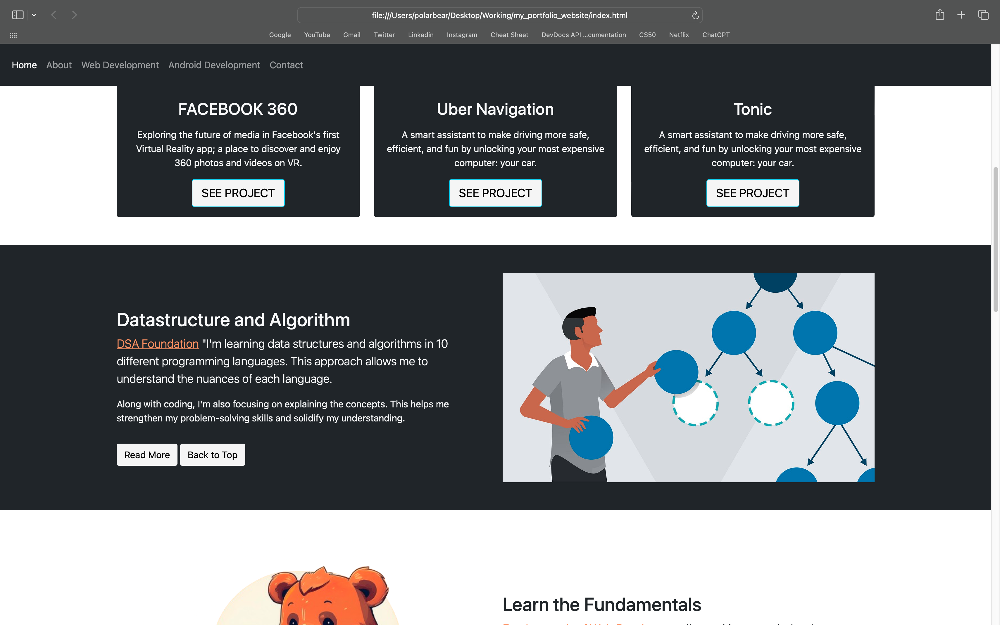
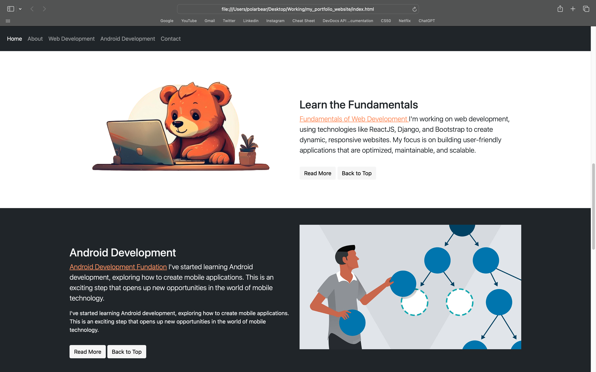
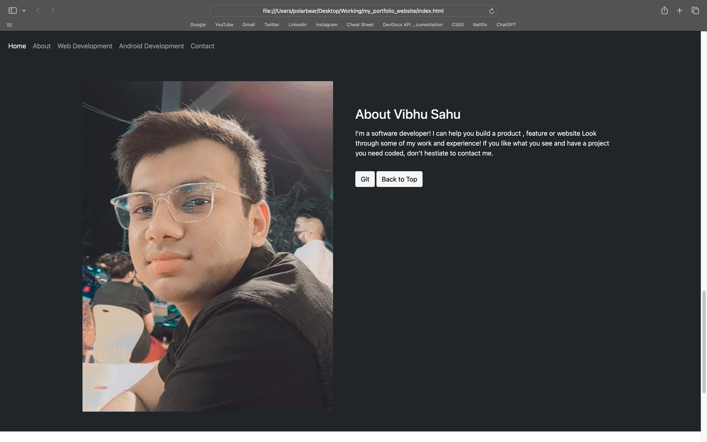
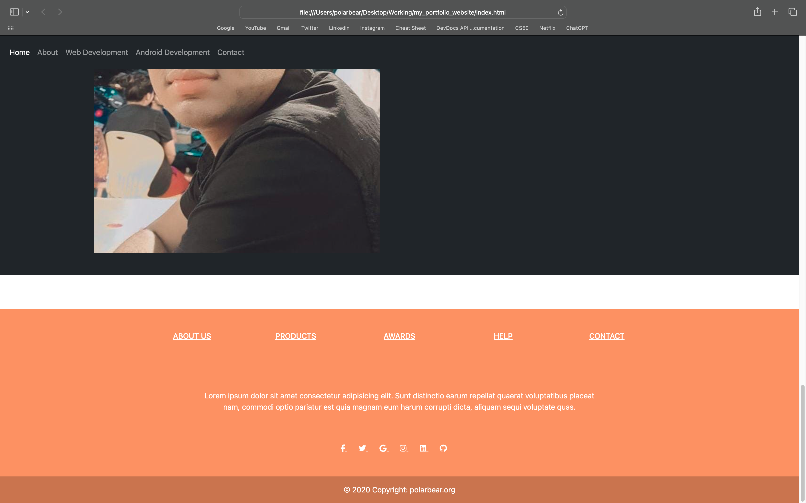

# Vibhu Sahu Portfolio Website

Welcome to my portfolio website! This project showcases my skills, projects, and the work I've been doing as a software developer. The website is built using **HTML**, **CSS**, **JavaScript**, and **Bootstrap** for a responsive and modern look. You can explore my projects, learn about me, and even reach out for freelancing opportunities.

## Website Features

- Introduction to who I am: A B.Tech Computer Science Engineering student with a passion for technology and innovation.
- Overview of my skills and current work.
- Learn more about my background, experiences, and what drives me as a developer.
- Links to my GitHub and other social profiles.
- My expertise in web development (ReactJS, Django, Bootstrap) and Android development.
- Ongoing learning journey in **Data Structures and Algorithms** using 10 different programming languages.
- Showcase of projects like **Facebook 360**, **Uber Navigation**, **Tonic**, with details and links.
- Newsletter and contact form for users to subscribe and reach out for project collaborations or freelancing.

## Screenshots

Here are some screenshots of the website:

## New Pages & Updates

I’m continuously updating the website with new content and features. The following sections will soon be available:

- **Blog Page**: A section for blog posts on web development, Android development, and tech topics.
- **Project Page**: Detailed view of all the projects I've worked on, including personal and freelancing projects.
- **Courses Page**: Free tutorials and guides on **Web Development**, **Android Development**, and **Data Structures and Algorithms**.
- **Freelancing**: Open to freelance projects, feel free to contact me via email.

## Technology Stack
- **HTML**
- **CSS**
- **JavaScript**
- **Bootstrap**

## Future Plans

### **Next.js Migration**
In the near future, I plan to migrate this project to **Next.js** for improved SEO, performance, and scalability. The migration will also enhance the development experience with features like **server-side rendering (SSR)** and **static site generation (SSG)**.

## Contact Information
If you have any questions, suggestions, or project proposals, feel free to contact me.

- Email: **vibhu6751@gmail.com**
- GitHub: [https://github.com/vibhusahu](https://github.com/vibhusahu)

Thank you for visiting my portfolio website! Stay tuned for more updates.

